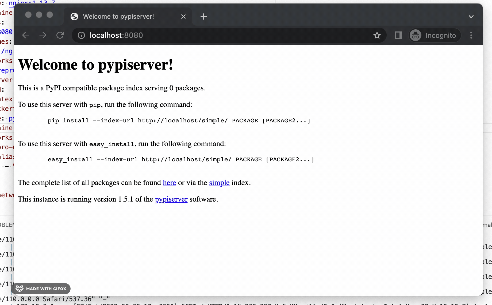
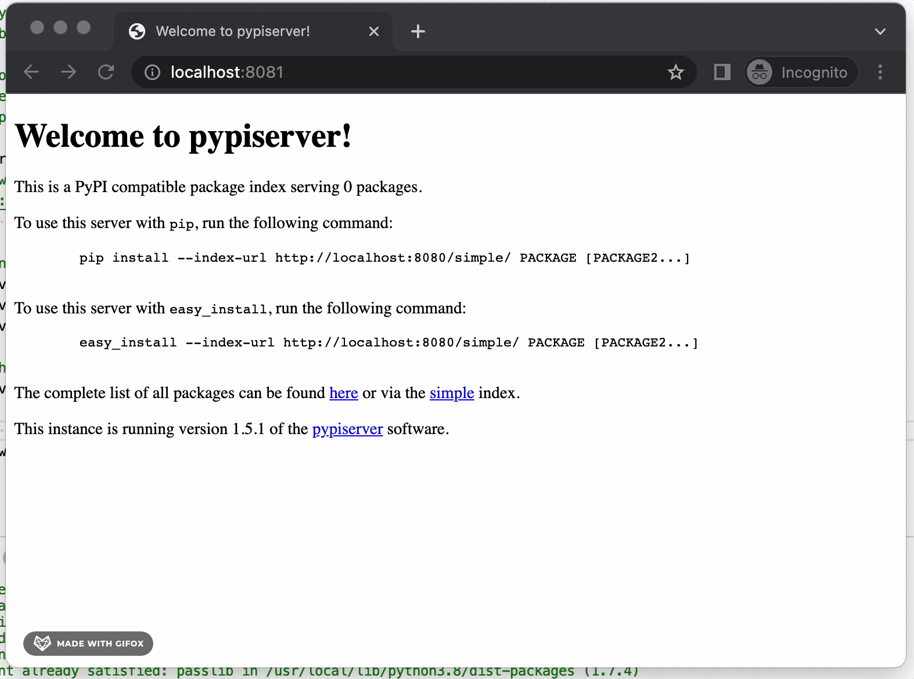

# What

This repo is a simplified reproduction of the <https://github.com/pypiserver/pypiserver/issues/476> issue for `pypiserver`.

## Setup

### Docker solution

To test the Docker setup, run `make run-compose`.

You should be able to access `pypiserver` behind the NGINX reverse proxy at `localhost:8080`.

> For more details see [`./docker-setup`](./docker-setup/)

#### Docker Result

> 

> 
Requesting basic auth on frontend running in Docker (.gif)

>  
> 
> 

### Vagrant solution

To test the Vagrant setup, run `make start-vagrant`.

You should be able to access `pypiserver` behind the NGINX reverse proxy at `localhost:8081`.

> For more information see [`./vagrant-setup`](./docker-setup/).  
> 💡 Once you would like to cleanup the vagrant machine run `make destroy-vagrant`.

#### Vagrant Result

> 

> 
Requesting basic auth on frontend running in Vagrant (.gif)

>  
> 
> 

